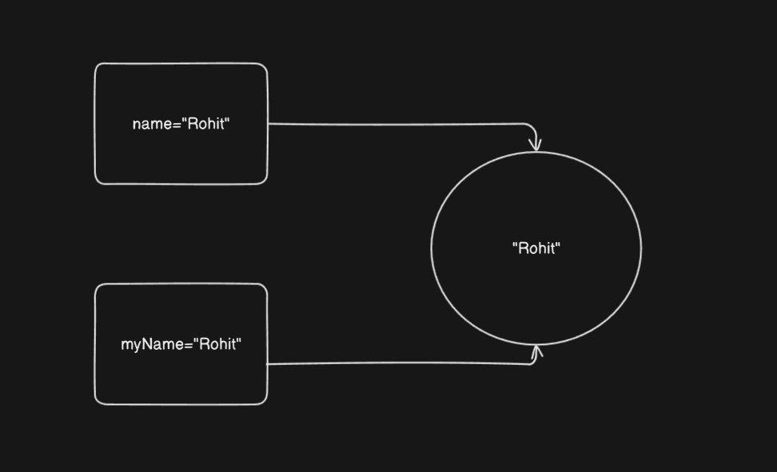

# Table of content
0. [Best books for python](#best-books-for-python)
1. [Installation process](#installation-process)
2. [Why Python language?](#why-python-language)
3. [Command line basics](#Windows-command-line-basics)
4. [Data types](#data-types)
5. [Operators](#operators)
6. [Variable assignments](#Variable-assignments)
	- [Rules for variable assignment](#valid-rules-for-naming-variables-in-python)
7. [Strings](#strings)
	- [Top 10 string methods](#top-10-string-methods)
	- [Print formatting with string](#print-formatting-with-string)
	- [Float formatting with f-string](#float-formatting-with-f-string)
8. [List](#list)
	- [Top 10 list methods](#top-10-list-methods)
9. [Dictionary](#dictionary)
	- [Top 6 dictionary methods](#top-10-dictionary-methods)
10. [Tuples](#tuples)
11. [Set](#set)
12. [Files](#files)
13. [Guess the number game](#guess-the-number-game)
14. [Map function](#map-function)
15. [Lambda function](#lambda-function)
16. [Global keyword](#global-keyword)
17. [args](#args)
18. [kwargs](#kwargs)
19. [OOP](#oop)
20. [Modify Object properties](#modify-object-properties)
21. [Delete object properties](#delete-object-properties)
22. [Delete objects](#delete-objects)
23. [Core concepts of OOP](#Core-Concepts-of-OOP-in-Python)
24. [Packages and Library](#packages-and-library)
25. [What is `__name__=="__main__"`?](#What-is-name-and-main)
26. [Handling Exceptions in Python](#Handling-exceptions-in-python)
27. [Python Decorators for Beginners](#python-decorators-for-beginners)
28. [Generator function](#generator-function)
39. [Collection module](#collection-module)
30. [OS module](#os-module)
	- [OS module methods](#os-module-methods)
31. [Shutil module](#shutil-module)
	- [Top 10 shutil methods](#Top-10-shutil-methods)
32. [Web scrapping](#web-scrapping)
    - [BeautifulSoup](#BeautifulSoup)
---
# Best books for python

#### Beginners

- **Python Crash Course** by Eric Matthes
- **Automate the Boring Stuff with Python** by Al Sweigart
#### Intermediate

- **Fluent Python** by Luciano Ramalho
- **High Performance Python** by Micha Gorelick & Ian Ozsvald

#### Data science and Machine Learning

- **Python for Data Analysis** by Wes McKinney
- **Hands-On Machine Learning with Scikit-Learn, Keras, and TensorFlow** by Aurélien Géron

#### Web development

- **Django for Beginners** by William S. Vincent

- **Flask Web Development** by Miguel Grinberg

#### Ethical hacking

- **Black Hat Python: Python Programming for Hackers and Pentesters** by Justin Seitz
---
# Installation process

## :desktop_computer: For windows:

#### Step 1: Download Python

1. Go to the official website: [https://www.python.org/downloads/](https://www.python.org/downloads/)
    
2. Click on the **Download Python 3.x.x** button (it detects your OS automatically).
#### Step 2: Run the Installer

1. Open the downloaded `.exe` file.
    
2. **Important**: Check the box that says **"Add Python to PATH"**.
    
3. Click **"Install Now"** (or choose "Customize Installation" if you want advanced options).
#### Step 3: Verify Installation

1. Open **Command Prompt**.
    
2. Type:
```python
python --version
```
or
```python
python3 --version
```
You should see something like:
```python
Python 3.12.0
```

## For macOS:

#### Step 1: Use the Official Installer (Recommended for Beginners)

1. Go to [https://www.python.org/downloads/mac-osx/](https://www.python.org/downloads/mac-osx/)
    
2. Download the latest `.pkg` installer.
    
3. Open it and follow the installation instructions.
    

#### Step 2: Add Python to PATH (if needed)

- macOS often includes Python, but it might be Python 2.x.
    
- Open **Terminal** and type:
```python
python3 --version
```
- If it’s not installed or outdated, consider using **Homebrew**:
#### Optional: Install with Homebrew (Advanced)
```python
/bin/bash -c "$(curl -fsSL https://raw.githubusercontent.com/Homebrew/install/HEAD/install.sh)"
brew install python
```

### **For Linux (Ubuntu/Debian)**

#### Step 1: Check if Python is Installed

- Open Terminal and type:
```python
python3 --version
```
#### Step 2: Install (if needed)
```python
sudo apt update
sudo apt install python3
```
### Step 3: Install pip (Python package manager)
```python
sudo apt install python3-pip
```

## ✅ **Post-Installation: Check Everything**

1. **Open terminal/command prompt**
    
2. Run:
```python
python --version
pip --version
```

---
# Virtual environment

## **Step 1:** Open your project folder

1. Launch `vs code`
2. Open the folder where you want to create the virtual environment:
	- `File`>`Open folder`
## **Step 2:**

1. Open `terminal`
## Windows:
```python
python -m venv venv
```
> This creates a folder named `venv` in your project directory

## **Step 3**: Activate the `virtual environment`

### Windows(CMD):
```python
venv\Scripts\activate
```
### Windows(Powershell):
```python
.\venv\Scripts\Activate.ps1
```
> After activation, your terminal prompt should show something like: `(venv)`

## **Step 4:** Select the Interpreter in VS Code

1. Press `Ctrl+Shift+P` to open Command Palette.
    
2. Type and select: `Python: Select Interpreter`
    
3. Choose the interpreter from the `.venv` folder, usually like:
```python
.\venv\Scripts\python.exe
```

## **Step 5:** Install Packages Inside the Virtual Environment

Once activated, use pip as usual:
```python
pip install flask
```
> Packages will install only inside the virtual environment.

### File structure

```
your-project/
├── venv/                  # Virtual environment (usually ignored in version control)
├── main.py                # Your main Python script
├── .env                   # For environment variables like API keys
├── requirements.txt       # Dependency list
└── .gitignore             # Ignore files/folders in Git
```


---
# Why `python` language

**Python is a beginner-friendly and highly versatile programming language, making it easy to learn and implement across various domains.** From web development and automation to data science and machine learning, Python is used virtually everywhere. Its clean syntax and vast ecosystem of libraries make it suitable for both simple tasks and complex projects.

In real-life applications, Python can help you:

- **Organize your digital files**: Automatically sort documents, photos, videos, and other files into appropriate folders based on type, name, or creation date.
    
- **Automate repetitive tasks**: Clean temporary files, rename batches of files, or schedule regular backups of important data.
    
- **Build intelligent tools**: Create your own AI agents or chatbots using frameworks like `LangChain`, `OpenAI API`, or `Rasa`.
    
- **Detect faces or objects**: Use OpenCV to build face detection systems or security monitoring apps.
    
- **Scrape data from websites**: Collect product data, reviews, or prices from sites like Amazon or Flipkart using libraries like `BeautifulSoup`, `Scrapy`, or `Selenium`.
    
- **Analyze and visualize data**: Use `Pandas`, `NumPy`, and `Matplotlib` to process and visualize large datasets for insights and decision-making.
    
- **Create web apps**: Develop scalable web applications using frameworks like `Django` or `Flask`.
    
- **Develop games**: Use `Pygame` to build 2D games for learning and entertainment.
    
- **Build desktop applications**: Use `Tkinter`, `PyQt`, or `Kivy` to create user-friendly software interfaces.
    
- **Control IoT devices**: Integrate Python with Raspberry Pi to automate home appliances or build smart home solutions.
    
- **Automate browser actions**: Fill out forms, log into accounts, and perform web tasks with `Selenium` or `Playwright`.
    
- **Monitor stock prices or cryptocurrencies**: Pull real-time financial data and automate trading strategies.
    

For example, if your friend asks for a list of the best laptops under $5000, you can write a Python script to scrape laptop listings from Amazon or Flipkart, extract details like price, brand, and features, and save the results in an Excel file using the `openpyxl` or `pandas` library to share easily.

---
# Windows command line basics

## 🖥️ **1. Opening Command Prompt**

- Press `Win + R`, type `cmd`, and press `Enter`
    
- Or search “Command Prompt” from the Start menu

## 📁2. Navigation commands:

| Command | Description                                      |
| ------- | ------------------------------------------------ |
| `dir`   | Lists files and folders in the current directory |
| `cd`    | Changes directory (e.g., `cd foldername`)        |
| `cd ..` | Moves up one directory level                     |
| `cd \`  | Goes to the root directory                       |
| `cls`   | Clears the screen                                |
## 📂 3. Working with Files and Folders

| Command                    | Description                   |
| -------------------------- | ----------------------------- |
| `mkdir newfolder`          | Creates a new folder          |
| `rmdir foldername`         | Removes a folder (empty only) |
| `del filename.txt`         | Deletes a file                |
| `copy file1.txt file2.txt` | Copies file1 to file2         |
| `move file1.txt C:\Backup` | Moves a file to a folder      |
## ⚙️ 4.  Running Programs and Scripts

| Command         | Description                                    |
| --------------- | ---------------------------------------------- |
| `program.exe`   | Runs an executable (if in PATH or current dir) |
| `start notepad` | Opens Notepad                                  |
| `yourfile.bat`  | Runs a batch script                            |
| `exit`          | Closes the Command Prompt window               |

## 🔍 5. Helpful Tips

- Press **Tab** to auto-complete file or folder names.
    
- Use the **up/down arrow keys** to scroll through previous commands.
    
- Use `help` to get a list of available commands.

---
# Data types

| Name       | Type  | Description                                                            | Example                                                                                                                                                                                                   |
| ---------- | ----- | ---------------------------------------------------------------------- | --------------------------------------------------------------------------------------------------------------------------------------------------------------------------------------------------------- |
| Integer    | `int` | Whole number such as 1,2,3,4 etc. which doesn't hold any fraction part | ```<br>age=20<br>print(age) # Output: 20<br>print(type(age)) # Output: <class 'int'><br>```                                                                                                               |
| Float      | float | Fraction number such as 1.5, 10.0                                      | ```<br>height=10.5<br><br>print(height) # Output: 10.5<br><br>print(type(height)) # Output: <class 'float'><br>```                                                                                        |
| String     | str   | Collection of characters such as `Ramesh`, `Pooja`                     | ```<br>name="Pooja"<br><br>print(name) # Output: Pooja<br><br>print(type(name)) # Output: <class 'str'><br>```                                                                                            |
| List       | list  | Collection of homogeneous or heterogeneous data types.                 | ```<br>cities=["Mumbai", "Pune", 200, 100]<br><br>print(cities) # Output: ['Mumbai', 'Pune', 200, 100]<br><br>print(type(cities)) # Output: <class 'list'><br>```                                         |
| Dictionary | dict  | Unordered `key:value` pair.                                            | ```<br>cityWithPopulation={"Mumbai": 100, "Pune": 200}<br><br>print(cityWithPopulation) # Output: {'Mumbai': 100, 'Pune': 200}<br><br>print(type(cityWithPopulation)) # Output: <class 'dict'><br>```     |
| Tuples     | tup   | Order immutable sequence of objects.                                   | ```<br>cities=("Mumbai", "Pune", 100, 200)<br><br>print(cities) # Output: ('Mumbai', 'Pune', 100, 200)<br><br>print(type(cities)) # Output: <class 'tuple'><br>```                                        |
| Sets       | set   | Unordered collection of unique objects.                                | ```<br>alpha={"a", "b", "c", "c"}<br><br>print(alpha) # Output: {'a', 'b', 'c'}<br><br>print(type(alpha)) # Output: <class 'set'><br>```                                                                  |
| Booleans   | bool  | Logical value indicate `True` or `False`                               | ```<br>yes=True<br><br>no=False<br><br>print(yes) # Output: True<br><br>print(type(yes)) # Output: <class 'bool'><br><br>print(no) # Output: False<br><br>print(type(no)) # Output: <class 'bool'><br>``` |

---
# Operators

Operators are special symbols or keywords used to perform operations on variables and values.

|Operator|Description|Example|Output|
|---|---|---|---|
|`+`|Addition|`5 + 3`|`8`|
|`-`|Subtraction|`5 - 2`|`3`|
|`*`|Multiplication|`4 * 3`|`12`|
|`/`|Division (float)|`10 / 4`|`2.5`|
|`//`|Floor Division|`10 // 4`|`2`|
|`%`|Modulus (remainder)|`10 % 3`|`1`|
|`**`|Exponentiation|`2 ** 3`|`8`|

# Variable assignments

Variable assignments means assigning name, number, string to variable. For example, if you have name called _Rohit_ that means _Rohit_ name assigned to you when you get born. Similarly in programming language assigning value to variable useful for future use.

#### Example 1:
```python
name="Rohit"

age=21

weight=65.80

print("Name:", name)

print("Age:", age)

print("Weight:", weight)
```
#### Output:
```python
Name: Rohit
Age: 21
Weight: 65.8
```


*Diagram 1*

> When you assign particular value to 2 or more variable on that time single data reference is shared to that 2 variable instead of creating individual object. See above `Diagram 1`. To check reference number, you can use `id()` method.

#### Example:
```python
name="Rohit"

myName="Rohit"

print(id(name))

print(id(myName))
```
#### Output:
```python
2391358551936
2391358551936
```
---
# ✅ Valid Rules for Naming Variables in Python

1. **Must begin with a letter (A-Z, a-z) or an underscore `_`**
    
    - Examples: `name`, `_value`, `age1`
        
2. **Can contain letters, digits (0-9), and underscores**
    
    - Valid: `user_name`, `value1`, `x_2_y`
        
3. **Cannot start with a digit**
    
    - ❌ Invalid: `1name`, `3_value`
        
4. **Cannot be a Python keyword or reserved word**
    
    - ❌ Invalid: `class`, `def`, `for`, `if`, `while`, etc.
        
    - Use `import keyword; print(keyword.kwlist)` to see all keywords.
        
5. **Python is case-sensitive**
    
    - `score`, `Score`, and `SCORE` are three different variables.
        

---

#### ✅ **Best Practices (Conventions)**

- Use **lowercase letters** and **underscores** for readability (PEP 8 style guide):
```python
total_amount = 100
user_name = "Alice"
```
- Use **UPPER_CASE** for constants (by convention):
```python
MAX_USERS = 50
```

---
# Strings

String is collection of characters. It can your name, address, pet name etc. Written in single quote `''` or double quote `""`. For example `name='Ramesh'` or `name="Ramesh"`. Strings are ordered sequences so it can be accessed through indexing. Indexing start from `0` to `n-1`. Negative indexing also exist in python language. To access particular character from string you can use `[]` square brackets. For example `myName[0]`. `myName` variable contains `Rohit` string, if you print `myName[0]` this would result in  `R`, because `R` is stored at `0` index. If you give negative index like `-10`, `-20`, this would print character from back to front.

#### Example:
```python
myName="Rohit"

print(myName[0]) # Output: R

print(myName[1]) # Output: o

print(myName[2]) # Output: h

print(myName[3]) # Output: i

print(myName[4]) # Output: t

print(myName[5]) # Output: IndexError: string index out of range

print(myName[-1]) # Output: t

print(myName[-2]) # Output: i

print(myName[-3]) # Output: h

print(myName[-4]) # Output: o

print(myName[-5]) # Output: R

print(myName[-6]) # Output: IndexError: string index out of range

print(myName[0:3]) # Output: Roh

print(myName[1:4]) # Output: ohi

print(myName[2:5]) # Output: hit

print(myName[3:6]) # Output: it

print(myName[0:6]) # Output: Rohit

print(myName[0:7]) # Output: Rohit

print(myName[0:8]) # Output: Rohit

print(myName[0:9]) # Output: Rohit

print(myName[0:10]) # Output: Rohit

print(myName[0:11]) # Output: Rohit

print(myName[0:12]) # Output: Rohit

print(myName[0:13]) # Output: Rohit

print(myName[0:14]) # Output: Rohit
```

---
# Top 10 `String` methods

1. `upper()` Convert all characters into uppercase.
```python
name="rohit"
print(name.upper()) # Output: ROHIT
```
2. `lower()` Converts all characters in lower case.
```python
name="ROHIT"
print(name.lower()) # Output: rohit
```
3. `strip()` Removes leading(starting) & trailing(Ending) whitespaces.
```python
name="    Rohit    "
print(name.strip()) # Output: Rohit
```
4. `replace("old","new")` Replace all occurence of substring with another.
```python
name="Rohit"
print(name.replace("R","M")) # Output: Mohit
```
5. `split(separator)` Split the string into list of substring. `separator` can be`,`, `.`, ` `.
```python
name="Rohit,Sharma"
nameList=name.split(",")
print(nameList) # Output: ["Rohit", "Sharma"]
print(type(nameList)) # Output: <class 'list'>
```

6. `join(iterable)` Joins elements of an iterable into single string.
```python
source="D:/Country"
myFolderLocation="States"
fullPath="/".join([source, myFolderLocation])
print(fullPath) # Output: D:/Country/States
print(type(fullPath)) # Output: <class 'str'>
```

7. `find(substring)` Returns the lowest index where the substring is found, or `-1` if not found. If string contains `Rohit Roshan`, only first occurence of character's index value returned. You can see in the example.
```python
name="RohitRoshan"
print(name.find("R")) # Output: 0
print(name.find("d")) # Output: -1
```

8. `startswith(prefix)` Check if the string starts with a specified substring. It returns `boolean` value.
```python
name="Rohit"

print(name.startswith("R")) # Output: True

fullName="Rohit Sharma"

print(fullName.startswith("Rohit")) # Output: True

print(fullName.startswith("Sharma")) # Output: False

print(fullName.startswith("Rohit Sharma")) # Output: True

print(fullName.startswith("Roh")) # Output: True
```

9. `endswith(suffix)` Check if the string ends with a specified substring.
```python
name="Rohit"
print(name.endswith("t")) # Output: True
fullName="Rohit Sharma"
print(fullName.endswith("Rohit")) # Output: False
print(fullName.endswith("Sharma")) # Output: True
```

10. `isdigit()` Returns `True` if all characters in the string are **Digits**.
```python
age="20"
print(age.isdigit()) # Output: True
```

---
# Print formatting with string

```python
name="Rohit"
print(name) # Output: Rohit
```
In the above example just name being displayed; what if you wanna add `Hello Rohit` instead of `Rohit`? This done by `formating`. See the below example:
```python
name="Rohit"
print("Hello",name) # Output: Hello Rohit
```
Another way to do this (**recommended**):
```python
name="Rohit"
print(f"Hello {name}") # Output: Hello Rohit
```

>The `f` stands for **f-string**, which is short for **formatted string literal** — a powerful way to embed variables or expressions directly inside strings.

---
# Float formatting with f-string

You can control the **number of decimal places**, **alignment**, and more using **format specifiers** inside `{}`.

What's the answer of `12/7`? Answer is `1.714286`. This number is too long to print onto console, however you can crop it by following method and result would be `1.7142` or how much decimal point you want, it arbitrary choice.

```python
value = 1.714286
print(f"Value is {value:.2f}")  # Output: Value is 1.71
```
**Explanation:**

- `:.2f` means:
    
    - `:` → Start format spec
        
    - `.2` → 2 decimal places. If you type `.4` answer would be `1.7142`
        
    - `f` → Fixed-point number (float)


---
# List

`List` are ordered sequences that can hold a variety of object types. They use square brackets `[]` and commas `,` to separate object in the `list`. Example `List=[1,"A","Hello"]`. `List` support _indexing_ & _slicing_. `List` can be nested & also have a variety of useful methods.

# Top 10 `python` `list` methods

## 1. `append(item)`  
   - **Description**: Adds an item to the end of the list.  
   
#### Example: 
```python
cities=["Pune","Mumbai"]

  

for i in cities:

    print(i)

print("----")

  

cities.append("Solapur")

for i in cities:

    print(i)
```
#### Output:
```python
Pune
Mumbai
----
Pune
Mumbai
Solapur
```

## 2. `extend(iterable)`  
   - **Description**: Extends the list by appending elements from an iterable.  
#### Syntax:
```python
list1.extend(iterable)
```
-  `iterable` is any iterable object (like list, tuple, set, string, etc.).
- It modifies `list1` **in place** and returns `None`.
#### Example:
```python
List=[]

  

for i in range(1,10):

    List.extend([i,i*2])

  

for i in List:

    print(i)
```
#### Output:
```python
1
2
2
4
3
6
4
8
5
10
6
12
7
14
8
16
9
18
```
## 3. `insert(index, item)`  
   - **Description**: Inserts an item at a specified position.  
   - **Example**:  
```python
lst = [1, 3]
lst.insert(1, 2)  # [1, 2, 3]
```

## 4. `remove(item)`  
   - **Description**: Removes the first occurrence of an item (raises `ValueError` if not found).  
   - **Example**:  
```python
lst = [1, 2, 2, 3]
lst.remove(2)  # [1, 2, 3]
```

## 5. `pop([index])`  
   - **Description**: Removes and returns the item at the given index (default: last element).  
   - **Example**:  
```python
lst = [1, 2, 3]
last = lst.pop()  # Returns 3, lst becomes [1, 2]
```

## 6. `index(item)`  
   - **Description**: Returns the index of the first occurrence of an item.  
   - **Example**:  
```python
lst = [10, 20, 30]
idx = lst.index(20)  # 1
```

## 7. `count(item)`  
   - **Description**: Returns the count of occurrences of an item.  
   - **Example**:  
```python
lst = [1, 2, 2, 3]
cnt = lst.count(2)  # 2
```

## 8. `sort(key=None, reverse=False)`  
   - **Description**: Sorts the list in place (modifies the original list).  
#### Example:
```python
lst = [3, 1, 2]

lst.sort(reverse=False)

print(lst) # [1, 2, 3] Ascending order

lst.sort(reverse=True)

print(lst) # # [3,2,1] Descending order
```
#### Output:
```python
[1, 2, 3]
[3, 2, 1]
```

## 9. `reverse()`  
   - **Description**: Reverses the list in place.  
   - **Example**:  
```python
lst = [1, 2, 3]
lst.reverse()  # [3, 2, 1]
```

## 10. `clear()`  
   - **Description**: Removes all items from the list.  
   - **Example**:  
```python
lst = [1, 2, 3]
lst.clear()  # []
```

## 11.  `copy()`  
   - **Description**: Returns a shallow copy of the list.  
   - **Example**:  
```python
lst = [1, 2, 3]
lst_copy = lst.copy()  # New list [1, 2, 3]
```
## 12. Add list value through loop
#### Example:
```python
my_list=[i for i in range(1,10) if i % 2==0] # my_list=[x for x in range(1,100)]

for i in my_list:

    print(i) # 2 4 6 8
```

---
# Dictionary

A **Dictionary** in Python is an unordered, mutable, and indexed collection of key-value pairs. It is defined using curly braces `{}` or the `dict()` constructor.

## Key Features:

- **Unordered** – Elements are not stored in any particular order.
- **Mutable** – Can be modified after creation.
- **Indexed by Keys** – Values are accessed using unique keys (not by position).
- **No Duplicate Keys** – Each key must be unique; duplicate keys overwrite existing values.
- **Heterogeneous** – Keys and values can be of any data type.

#### Syntax:
```python
my_dict = {key1: value1, key2: value2, ...}
# or
my_dict = dict(key1=value1, key2=value2, ...)
```
#### Example 1:
```python
student = {
    "name": "Alice",
    "age": 21,
    "courses": ["Math", "Physics"]
}

print(student["name"])  # Output: Alice
print(student["courses"][0]) # Output: Math
```
#### Output:
```python
Alice
Math
```

#### Example 2:
```python
ITCompanies=dict(Intel=1000,Google=2000)
print(ITCompanies["Intel"])
```
#### Output:
```python
1000
```

# Top 6 `dictionary` methods

1. `dict.keys()` Returns all keys
#### Example:
```python
cities={"Pune":1000, "Mumbai":2000}

keys=cities.keys()

print(keys)

print(type(keys))
```
#### Output:
```python
dict_keys(['Pune', 'Mumbai'])
<class 'dict_keys'>
```

2. `dict.values()` Return list of values.
#### Syntax:
```python
dict.values()
```
#### Example:
```python
cities={"Pune":1000, "Delhi":2000}

  

values=cities.values()

  

print(values)

print(type(values))

sum=0

  

for i in values:

    sum+=i

  

print(sum)
```
#### Output:
```python
dict_values([1000, 2000])
<class 'dict_values'>
3000
```

3. `dict.items()` Return `tuple` of *key-value* pair.
#### Syntax:
```python
dict.items()
```
#### Example:
```python
cities={"Pune":1000, "Delhi":2000}

values=cities.items()

for i in values:

    print(i)

    print(type(i))
```
#### Output:
```python
('Pune', 1000)
<class 'tuple'>
('Delhi', 2000)
<class 'tuple'>
```

4. `dict.get()` Retrieve value safely.
#### Syntax:
```python
dict.get(key)
```
#### Example:
```python
cities={"Pune":1000, "Delhi":2000}

print(cities.get("Pune"))
```
#### Output:
```python
1000
```

5. `update()` Add new *key-value* pair.
#### Syntax:
```python
dict.update({"key":value})
```
#### Example:
```python
cities={"Pune":1000, "Delhi":2000}
cities.update({"Kochi":10000})
print(cities)
```
#### Output:
```python
{'Pune': 1000, 'Delhi': 2000, 'Kochi': 10000}
```

6. `pop(key)` Remove and return value.
#### Syntax:
```python
removed_value=dict.pop(key)
```
#### Example:
```python
cities={"Pune":1000, "Delhi":2000}

removed_value=cities.pop("Delhi")

print(cities)
```
#### Output:
```python
{'Pune': 1000}
```

---
# Tuples

A **tuple** in Python is an ordered collection of elements that is immutable (cannot be changed after creation). Tuples are similar to lists, but unlike lists, their contents cannot be modified (you can't add, remove, or change elements once they are created).

### Key Characteristics of Tuples:

1. **Ordered**: Tuples maintain the order of the elements.
    
2. **Immutable**: Once created, the elements of a tuple cannot be modified.
    
3. **Heterogeneous**: Tuples can contain elements of different data types (integers, strings, lists, other tuples, etc.).
    
4. **Indexing and Slicing**: You can access elements using indexing or slicing, just like lists.
    
5. **Iterable**: Tuples can be iterated over in loops.
    
6. **Hashable**: Because they are immutable, tuples can be used as keys in dictionaries, unlike lists.

#### Syntax:
```python
tuple_name = (element1, element2, element3, ...)
```
#### Example 1:
```python
# Tuple with multiple elements
my_tuple = (1, 2, 3, 4)

# Tuple with a single element (note the trailing comma)
single_element_tuple = (5,)

# Empty tuple
empty_tuple = ()

# Tuple with mixed data types
mixed_tuple = (1, "hello", 3.14, True)
```

> If you don't include the comma, Python will just consider the value inside the parentheses as a single element (Assume `int` ), not a tuple.

#### Example 2:
```python
# Tuple as a key in a dictionary
my_dict = {
    ('apple', 1): "Fruit",
    ('banana', 2): "Fruit",
    ('carrot', 3): "Vegetable"
}

# Accessing the value using the tuple as the key
print(my_dict[('apple', 1)])  # Output: Fruit
print(my_dict[('banana', 2)])  # Output: Fruit
```

---
# Set

A **set** in Python is an **unordered** collection of **unique** elements. It is a built-in data type that is similar to a list or tuple, but with some key differences. The most important distinction is that sets do **not** allow duplicate values and do not maintain any order of elements.

### Key Characteristics of Sets:

1. **Unordered**: The elements of a set are not stored in any particular order, and their order may change each time you interact with the set.
    
2. **Unique Elements**: Sets do not allow duplicates. If you try to add the same element multiple times, it will only appear once in the set.
    
3. **Mutable**: Sets are mutable, meaning you can add and remove elements from a set.
    
4. **No Indexing**: You cannot access elements in a set by index like you can with lists or tuples. You can only iterate over the set.
    
5. **Hashable Elements**: Elements inside a set must be hashable, meaning they must be immutable (like numbers, strings, or tuples). Mutable types like lists cannot be added to a set.

#### Syntax:
```python
# Creating a set
my_set = {1, 2, 3, 4}
empty_set = set()  # An empty set (note: {} creates an empty dictionary, not a set)
```

---
# Files

When you want to work with files like `Excel`, `CSV`, `text`, by editing and changing in it. There are tons of methods used to do so. `open()` method in used to open file for operation.
#### Syntax:
```python
file_pointer=open("file_name.extension","mode")
```

#### Example:
```python
fp=open("Sample.txt") # text file contains "Hello, dude"

print(fp.read())
```
#### File directory:
```python
Python-src-code/
    |---Playground.py
    |---Sample.txt
```
> `python` file and `text` file must be in same directory to perform operations.

How to move `cursor` up and down? You can do it by `seek()` method, which let you put your `cursor` where you want. When you read file by `read()` method, after reading it move `cursor` to next line, so if you want to move `cursor` back to top, you can do it by `seek()` method. After doing your file operation, please `close` file by `file_pointer.close()` method

> `read()` method read entire file content with escape characters.

#### Example:
```python
fp=open("Sample.txt")

print(fp.read())

fp.seek(0)  # Reset file pointer to the beginning

print(fp.readline())
fp.close()
```
#### Output:
```python
Hello, dude.
Hello, dude.
```

# Writing to file

By default, the `open()` function will only allow us to read the file. We need to pass the argument `'w'` to write over the file. Before writing data into file, we must know `mode` to work with files in better manner, check out following table.

| Mode | Description                                                                                                 |
| ---- | ----------------------------------------------------------------------------------------------------------- |
| `r`  | **Read** (default mode). Opens the file for reading. Error if the file doesn't exist.                       |
| `w`  | **Write**. Creates a new file or truncates the file if it exists.                                           |
| `a`  | **Append**. Creates a new file if it doesn’t exist, otherwise appends to the end.                           |
| `x`  | **Exclusive creation**. Creates a file, but fails if it already exists.                                     |
| `b`  | **Binary** mode. Used to handle binary files (e.g., images, audio). Add to other modes like `'rb'`, `'wb'`. |
| `t`  | **Text** mode (default). Used for text files. Combine with other modes like `'rt'`, `'wt'`.                 |
| `+`  | **Update**. Opens the file for reading and writing (e.g., `'r+'`, `'w+'`).                                  |
# File methods

|Method|Description|
|---|---|
|`read(size=-1)`|Reads entire file or up to `size` bytes.|
|`readline(size=-1)`|Reads one line from the file.|
|`readlines()`|Reads all lines and returns them as a list.|
|`write(string)`|Writes a string to the file.|
|`writelines(lines)`|Writes a list of strings to the file (no newline added automatically).|
|`seek(offset, whence=0)`|Moves the file pointer to a specific position.|
|`tell()`|Returns the current position of the file pointer.|
|`close()`|Closes the file. Always do this unless using `with`.|
|`flush()`|Forces the write buffer to be written to disk.|
|`truncate(size=None)`|Truncates the file to `size` bytes (or current position if not specified).|
1. `write()` Write data into file.
#### Example:
```python
fp=open("Sample.txt","w")

  

for i in range(65,91):

     fp.write(chr(i)+"\n") # fp.write(f"{chr(i)}\n") <-- Alternative way
```
#### Output:
```python
A
B
C
D
E
F
G
H
I
J
K
L
M
N
O
P
Q
R
S
T
U
V
W
X
Y
Z

```

> 1. Write program which print table from 1 to 100 into file.

#### Solution:
```python
with open('tables_1_to_100.txt', 'w') as f:

    for i in range(1, 101):  # Tables from 1 to 100

        f.write(f"Multiplication Table of {i}\n")

        f.write("-" * 30 + "\n")

        for j in range(1, 11):  # Each table up to 10

            f.write(f"{i} x {j} = {i * j}\n")

        f.write("\n")  # Blank line between tables
```

---
# Comparison operator

When you compare values by `==` operator on that time it compares value, if you wanna check object ID is same or not on that time you can use `is`.

#### Example:
```python
num_1=1

num_2=1

  

if(num_1==num_2):

    print("The numbers are equal.")

else:

    print("The numbers are not equal.")

if num_1 is num_2:

    print("The numbers are identical.")

else:

    print("The numbers are not identical.")
```
#### Output:
```python
The numbers are equal.
The numbers are identical.
```

---
# `enumerate` function

In Python, the `enumerate()` function is used to **loop over an iterable (like a list, tuple, or string) and keep track of the index** of the current item.

#### Syntax:
```python
enumerate(iterable, start=0)
```
#### Example:
```python
fruits = ['apple', 'banana', 'cherry']

  

for index, fruit in enumerate(fruits):

    print(index, fruit)
```
#### Output:
```python
0 apple
1 banana
2 cherry
```

> It eliminates the need to manually track indexes with a counter variable.
---
# Random module

Visit [here](https://docs.python.org/3/library/random.html#functions-for-integers) to see `random` package document.

# Top 10 `random` methods.

| Method                                   | Description                                                  |
| ---------------------------------------- | ------------------------------------------------------------ |
| `random()`                               | Returns a float between **0.0** and **1.0**                  |
| `randint(a, b)`                          | Returns a random **integer** between `a` and `b` (inclusive) |
| `randrange(start, stop[, step])`         | Returns a random **integer from a range**, like `range()`    |
| `uniform(a, b)`                          | Returns a **random float** between `a` and `b`               |
| `choice(seq)`                            | Returns a **random element** from a non-empty sequence       |
| `choices(population, k=1, weights=None)` | Returns a list of `k` random elements (with **replacement**) |
| `sample(population, k)`                  | Returns `k` unique random elements (**no replacement**)      |
| `shuffle(seq)`                           | **Shuffles** a list (in-place)                               |
| `seed(a=None)`                           | Sets the seed for reproducibility of random results          |
| `betavariate(alpha, beta)`               | Returns a random float from a **beta distribution**          |
#### Example:
```python
import random

print(random.random())          # 0.345... (float between 0 and 1)
print(random.randint(1, 10))    # e.g., 7
print(random.randrange(0, 100, 5))  # e.g., 25
print(random.uniform(1.5, 5.5)) # e.g., 3.87

colors = ['red', 'green', 'blue']
print(random.choice(colors))   # e.g., 'green'
print(random.choices(colors, k=2))  # e.g., ['red', 'red']
print(random.sample(colors, 2))     # e.g., ['blue', 'green']

nums = [1, 2, 3, 4, 5]
random.shuffle(nums)
print(nums)  # e.g., [3, 1, 4, 5, 2]

random.seed(42)  # Sets seed for reproducible results
```

---
# Guess the number game
```python
import random

  

while True:

    user_input=int(input("Enter a number between 1 and 10 (or 0 to exit): "))

    if user_input == random.randint(1,10):

        print("Congratulations! You guessed the number correctly.")

    else:

        print("Sorry, that's not correct. Try again.")
```

---
# `map()` function

The `map()` function in Python is used to apply a **function** to **each item** in an **iterable** (like a list, tuple, etc.) and return a new iterable (a map object) with the results.

#### Syntax:
```python
map(function, iterable)
```
- `function`: A function that will be applied to every item in the iterable.
    
- `iterable`: A sequence (like a list, tuple, etc.) whose elements you want to process.
#### Example:
```python
def square(num):

    return num*num
    
my_list=[1,2,3,4,5,6,7]

final_value=map(square,my_list)

print(list(final_value))
```
#### Output:
```python
[1, 4, 9, 16, 25, 36, 49]
```

# `lambda` function

#### Syntax:
```python
lambda arguments: expression
```
#### Example 1:
```python
add = lambda x, y: x + y

print(add(5, 3))  # Output: 8
```
#### Example 2:
```python
add=lambda x,y,z:x+y+z
print(add(10,20,30))
```

---
# `global` keyword

The `global` keyword in Python is used to **modify a global variable inside a function**.

By default, when you assign a value to a variable inside a function, Python treats it as **local to that function**. If you want to modify a variable that exists outside the function (in the global scope), you need to declare it as `global`.

#### Example:
```python
x = 10

def change():
    global x
    x = x + 5  # Now Python knows you're referring to the global x
    print(x)

change()       # Output: 15
print(x)       # Output: 15
```

---
# `args`

`*args` allows a function to accept **any number of positional arguments** (i.e., values passed without keywords).

#### Syntax:
```python
def function_name(*args):
    for arg in args:
        print(arg)
```

- The `*` before `args` **collects all extra positional arguments** into a **tuple** named `args`.
    
- You can name it anything (`*data`, `*values`, etc.) — `args` is just a convention.
#### Example:
```python
def greet(*args):
    for name in args:
        print(f"Hello, {name}!")

greet("Alice", "Bob", "Charlie")
```

---
# `kwargs`

`**kwargs` allows a function to accept **any number of keyword arguments** (i.e., arguments passed as `key=value` pairs).

#### Syntax:
```python
def function_name(**kwargs):
    for key, value in kwargs.items():
        print(f"{key} = {value}")
```

- The `**` collects extra keyword arguments into a **dictionary** named `kwargs`.
    
- You can name it anything (`**options`, `**params`, etc.) — `kwargs` is just a convention.
#### Example:
```python
def print_profile(**kwargs):
    for key, value in kwargs.items():
        print(f"{key}: {value}")

print_profile(name="Alice", age=30, city="New York")
```
#### Output:
```python
name: Alice
age: 30
city: New York
```

---
# OOP

```python
class Animal:
    def __init__(self, name):
        self.name = name

    def speak(self):
        print("Some sound")

class Dog(Animal):  # Dog inherits from Animal
    def speak(self):
        print(f"{self.name} says Woof!")

d = Dog("Buddy")
d.speak()
```

Object is entity which store `attribute, methods`. If inherited class doesn't contain any `constructor` then it try to find in `base` class. You can also call `method` without `instance` by `@staticmethod` or `@classmethod` decorator.

- `@classmethod` Use when the method needs access to the class itself (not a specific instance).
- `@staticmethod` Use when the method doesn’t need access to `self` (the instance) or `cls` (the class).

```python
class Parent:

    def __init__(self,firstName):

        self.firstName=firstName

    def heydude(self,lastName):

        self.lastName=lastName

obj=Parent("John")

obj.heydude("Wick")

print(obj.firstName)

print(obj.lastName)
```

---
# Modify object properties

#### Syntax:
`obj.age=30 # Changed 21 to 30`

# Delete object properties
#### Syntax:
`del obj.age`

# Delete objects

#### Syntax:
`del obj`

---
# Core Concepts of OOP in Python

Object-Oriented Programming (OOP) in Python revolves around four main principles: **Encapsulation**, **Abstraction**, **Inheritance**, and **Polymorphism**. Below is an explanation of each concept with examples.

---

## 1. Encapsulation
**Definition:** Bundling data (attributes) and methods (functions) that operate on the data into a single unit (class), while restricting access to some components.

### Example:
```python
class BankAccount:
    def __init__(self, balance):
        self.__balance = balance  # Private attribute

    def deposit(self, amount):
        if amount > 0:
            self.__balance += amount

    def get_balance(self):
        return self.__balance

account = BankAccount(1000)
account.deposit(500)
print(account.get_balance())  # Output: 1500
# print(account.__balance)  # Error: Attribute is private
```

---

## 2. Abstraction
**Definition:** Hiding complex implementation details and showing only the essential features.

### Example:
```python
from abc import ABC, abstractmethod

class Shape(ABC):
    @abstractmethod
    def area(self):
        pass

class Circle(Shape):
    def __init__(self, radius):
        self.radius = radius

    def area(self):
        return 3.14 * self.radius ** 2

circle = Circle(5)
print(circle.area())  # Output: 78.5
```

---

## 3. Inheritance
**Definition:** Creating a new class (child) from an existing class (parent), inheriting its attributes and methods.

### Example:
```python
class Animal:
    def speak(self):
        print("Animal speaks")

class Dog(Animal):
    def speak(self):
        print("Dog barks")

dog = Dog()
dog.speak()  # Output: Dog barks
```

---

## 4. Polymorphism
**Definition:** The ability to use a common interface for different data types or classes.

### Example:
```python
class Cat:
    def speak(self):
        print("Cat meows")

class Duck:
    def speak(self):
        print("Duck quacks")

def animal_sound(animal):
    animal.speak()

cat = Cat()
duck = Duck()

animal_sound(cat)   # Output: Cat meows
animal_sound(duck)  # Output: Duck quacks
```

---

### Summary Table
| Concept       | Description                              | Example Use Case          |
|---------------|------------------------------------------|---------------------------|
| Encapsulation | Restricts access to data/methods         | Secure bank transactions  |
| Abstraction   | Hides complex details                   | Shape area calculation    |
| Inheritance   | Reuses parent class properties           | Dog inheriting from Animal|
| Polymorphism  | One interface, multiple implementations  | Different animals speaking|

---
# Packages and Library
## **Package**
A **package** in Python is a way to organize related modules into a directory hierarchy. It's essentially a folder that contains Python modules (`.py` files) and a special `__init__.py` file (which can be empty) to indicate that the directory should be treated as a package.

### **Key Characteristics of a Package:**
- Contains multiple Python modules (`.py` files).
- Must include an `__init__.py` file (even if empty).
- Can be imported using `import package_name`.
- Helps in organizing code into a structured hierarchy.
- Can have sub-packages (nested directories with their own `__init__.py`).

### **Example:**
```
my_package/  
│  
├── __init__.py  
├── module1.py  
└── module2.py  
```
- Importing:  
  ```python
  import my_package.module1
  from my_package import module2
  ```

---

## **Library**
A **library** is a collection of related **packages and modules** that provide reusable functionality. It is a broader concept than a package and can consist of one or more packages.

### **Key Characteristics of a Library:**
- A library is a **collection of packages and modules**.
- It is meant to be reused in different projects.
- Examples: `NumPy`, `Pandas`, `Requests`, `Matplotlib`.
- Installed via `pip` (e.g., `pip install numpy`).
- Can be a single module (e.g., `datetime`) or multiple packages (e.g., `scikit-learn`).

### **Example:**
- `requests` is a **library** that contains multiple modules (`api.py`, `models.py`, etc.) organized into packages.
- You install it via:
  ```bash
  pip install requests
  ```
- Then use it:
  ```python
  import requests
  response = requests.get("https://example.com")
  ```

---

## **Key Differences**
| Feature        | **Package**                          | **Library**                          |
|---------------|--------------------------------------|--------------------------------------|
| **Definition** | A directory with `__init__.py` and modules. | A collection of packages/modules for reuse. |
| **Purpose**   | Organizes related modules.           | Provides reusable functionality.     |
| **Structure** | Contains `.py` files + `__init__.py`. | Can consist of multiple packages.    |
| **Installation** | Can be local or installed via `pip`. | Usually installed via `pip`.         |
| **Example**   | `my_package/` (custom)               | `numpy`, `pandas`, `requests`        |

---

## **Summary**
- A **package** is a **folder with modules** (`__init__.py` + `.py` files).
- A **library** is a **collection of packages/modules** (e.g., `numpy`, `pandas`).
- A library can **contain multiple packages**, while a package is a **single unit of organization**.

### **Example Analogy:**
- A **module** → A single file (`book.py`).
- A **package** → A folder containing books (`books/` + `__init__.py`).
- A **library** → The entire bookshelf with multiple folders (`numpy`, `pandas`).

---
# What is name and main?

n Python, `if __name__ == "__main__":` is a common construct used to check whether a Python script is being run as the main program or being imported as a module into another script.

### **Explanation:**
1. **`__name__`** is a built-in variable in Python:
   - When a Python script is executed directly, `__name__` is set to `"__main__"`.
   - If the script is imported as a module into another script, `__name__` is set to the module's name (i.e., the filename without `.py`).

2. **Purpose of `if __name__ == "__main__":`**  
   - It allows certain code to run **only when the script is executed directly**, not when it's imported.
   - This is useful for writing reusable modules where some code (like tests or demo functionality) should only run when the script is the main program.

### **Example:**
```python
# example.py

def greet():
    print("Hello from greet()!")

print("This will always run when the script is executed or imported.")

if __name__ == "__main__":
    print("This will only run if example.py is executed directly.")
    greet()
```

#### **Case 1: Running `example.py` directly**
```sh
python example.py
```
**Output:**
```
This will always run when the script is executed or imported.
This will only run if example.py is executed directly.
Hello from greet()!
```

#### **Case 2: Importing `example.py` into another script**
```python
# another_script.py
import example

example.greet()
```
**Output:**
```
This will always run when the script is executed or imported.
Hello from greet()!
```
(Notice that the code inside `if __name__ == "__main__":` did not run.)

### **Why Use It?**
- **Prevents unintended execution** when the script is imported.
- **Makes code reusable** (functions/classes can be imported without running demo code).
- **Common in scripts** to separate library-like code from direct execution behavior.

This pattern is widely used in Python programs to maintain clean and modular code.

---
# Handling Exceptions in Python

Exception handling in Python is done using `try`, `except`, `else`, and `finally` blocks. Here's how to properly handle exceptions:

## Basic Exception Handling

```python
try:
    # Code that might raise an exception
    result = 10 / 0
except ZeroDivisionError:
    # Handle specific exception
    print("You can't divide by zero!")
```

## Handling Multiple Exceptions

```python
try:
    # Code that might raise exceptions
    value = int("not_a_number")
    result = 10 / value
except ValueError:
    print("That's not a valid number!")
except ZeroDivisionError:
    print("You can't divide by zero!")
```

## Generic Exception Handling

```python
try:
    # Risky code
    file = open("nonexistent.txt")
except Exception as e:  # Catches all exceptions
    print(f"An error occurred: {e}")
```

## Using else and finally

```python
try:
    print("Trying something...")
    result = 10 / 2
except ZeroDivisionError:
    print("Division by zero!")
else:
    print("No exceptions occurred! Result is:", result)
finally:
    print("This always runs, whether exception occurred or not")
```

## Raising Exceptions

You can also raise exceptions manually:

```python
def validate_age(age):
    if age < 0:
        raise ValueError("Age cannot be negative")
    return age

try:
    validate_age(-5)
except ValueError as e:
    print(e)
```

## Custom Exceptions

```python
class MyCustomError(Exception):
    pass

try:
    raise MyCustomError("Something went wrong")
except MyCustomError as e:
    print(f"Caught custom exception: {e}")
```

Remember:
- Be specific with exception types when possible
- Avoid bare `except:` clauses (without specifying exception type)
- Use `finally` for cleanup code (like closing files)
- The `else` block runs only if no exception occurred

---
# Python Decorators for Beginners

A decorator in Python is a way to modify or enhance functions without changing their actual code. Think of it like wrapping a gift - the original gift (function) stays the same, but you're adding some extra decoration around it.

## Simple Explanation

Imagine you have a function that says hello:

```python
def say_hello():
    print("Hello!")
```

Now you want to add some extra behavior before and after this function runs, like printing "About to say hello" before and "Done saying hello" after. Instead of changing the function itself, you can use a decorator.

## Basic Decorator Example

Here's how a simple decorator works:

```python
# This is the decorator function
def my_decorator(func):
    def wrapper():
        print("About to say hello")
        func()  # This calls the original function
        print("Done saying hello")
    return wrapper

# Applying the decorator to our function
@my_decorator
def say_hello():
    print("Hello!")

# When we call say_hello(), the decorator adds the extra behavior
say_hello()
```

Output:
```
About to say hello
Hello!
Done saying hello
```

## What Just Happened?

1. We created a decorator `my_decorator` that takes a function (`func`) as input
2. Inside, we defined a `wrapper` function that adds extra behavior around `func`
3. We used `@my_decorator` to apply this decorator to `say_hello`
4. Now when we call `say_hello()`, it actually runs the wrapped version

## Real-World Example: Timing a Function

Decorators are often used to time how long a function takes to run:

```python
import time

def timer_decorator(func):
    def wrapper():
        start_time = time.time()
        func()
        end_time = time.time()
        print(f"Function took {end_time - start_time:.2f} seconds to run")
    return wrapper

@timer_decorator
def slow_function():
    time.sleep(2)  # Simulate a slow function
    print("Function completed")

slow_function()
```

Output:
```
Function completed
Function took 2.00 seconds to run
```

## Why Use Decorators?

- Keep your original function clean and simple
- Add reusable behavior to multiple functions
- Separate concerns (the function's job vs. extra behavior)
- Easy to remove or change decorations

Let's break down the execution of the decorator example step by step. I'll use the first simple example with `my_decorator` and `say_hello` to explain how Python processes decorators.

## The Code We're Analyzing:
```python
def my_decorator(func):
    def wrapper():
        print("About to say hello")
        func()
        print("Done saying hello")
    return wrapper

@my_decorator
def say_hello():
    print("Hello!")

say_hello()
```

## Step-by-Step Execution:

### 1. Defining the Decorator
```python
def my_decorator(func):
    def wrapper():
        print("About to say hello")
        func()
        print("Done saying hello")
    return wrapper
```
- Python defines a function called `my_decorator` that takes one parameter `func`
- Inside it, defines another function `wrapper` that will wrap around `func`
- `my_decorator` returns this `wrapper` function

*At this point, nothing is executed yet - we're just defining things.*

### 2. Applying the Decorator
```python
@my_decorator
def say_hello():
    print("Hello!")
```
Here's what happens behind the scenes:
1. Python defines the original `say_hello` function
2. Then it immediately passes this function to `my_decorator` (because of the `@` syntax)
3. `my_decorator(say_hello)` is called:
   - `func` parameter receives the original `say_hello` function
   - The `wrapper` function is created (but not called yet)
   - `my_decorator` returns this `wrapper` function
4. Now the name `say_hello` is reassigned to point to this `wrapper` function

*After this, `say_hello` no longer refers to the original function - it refers to the wrapped version.*

### 3. Calling the Decorated Function
```python
say_hello()
```
Now when we call `say_hello()`, we're actually calling the `wrapper` function that was returned by the decorator. Here's what happens:

1. `wrapper()` executes:
   - First prints "About to say hello"
   - Then calls `func()` - which is the original `say_hello` function
     - Original `say_hello` executes and prints "Hello!"
   - Then prints "Done saying hello"

## Visualizing the Flow

1. Define `my_decorator` (just stores the definition)
2. Define `say_hello` but immediately decorate it:
   - Original `say_hello` gets passed to `my_decorator`
   - `my_decorator` returns a new function (`wrapper`) that wraps the original
   - Name `say_hello` now points to this wrapped version
3. Call `say_hello()` which is actually calling `wrapper()`:
   - wrapper's code runs
   - wrapper calls the original function when it hits `func()`

## Key Points to Remember:

1. Decorators run when the function is defined, not when it's called
2. The `@decorator` syntax is just a shortcut for:
   ```python
   def say_hello(): ...
   say_hello = my_decorator(say_hello)
   ```
3. The original function gets replaced by the wrapper function
4. When you call the decorated function, you're actually calling the wrapper

This "wrapping" behavior is why we call them decorators - they wrap the original function with additional functionality.

---
# Generator function

In Python, the **`yield`** keyword is used in a function to turn it into a **generator**. Generators allow you to iterate over a sequence of values without storing them all in memory at once, making them memory-efficient for large datasets.

### **Key Features of `yield`:**
1. **Lazy Evaluation**: Values are generated on-the-fly (one at a time) when iterated over.
2. **Stateful Execution**: The function remembers its state between calls (unlike normal functions, which reset after `return`).
3. **Memory Efficient**: Only one value is held in memory at a time.

---

### **How `yield` Works:**
- When a function contains `yield`, it becomes a **generator function**.
- Instead of returning a value and exiting, `yield` **pauses** the function, saving its state.
- The next time the generator is called (e.g., in a loop), execution resumes from where it left off.

---

### **Example: Simple Generator**
```python
def count_up_to(n):
    count = 1
    while count <= n:
        yield count  # Pauses here and returns 'count'
        count += 1

# Using the generator
for num in count_up_to(5):
    print(num)
```
**Output:**
```
1
2
3
4
5
```

---

### **Difference Between `return` and `yield`**
| Feature          | `return`                          | `yield`                          |
|------------------|----------------------------------|----------------------------------|
| **Execution**    | Exits the function               | Pauses the function              |
| **Memory**       | Returns a single value           | Generates values one by one      |
| **State**        | Loses state after execution      | Remembers state between calls    |
| **Usage**        | Normal functions                 | Generator functions              |

---

### **Common Use Cases**
1. **Processing Large Files** (Read line by line without loading entire file).
2. **Infinite Sequences** (e.g., Fibonacci series).
3. **Memory Optimization** (Avoid storing large lists in memory).

---

### **Example: Infinite Sequence**
```python
def infinite_sequence():
    num = 0
    while True:
        yield num
        num += 1

gen = infinite_sequence()
print(next(gen))  # 0
print(next(gen))  # 1
# ... continues infinitely
```

---

### **Key Takeaways**
- `yield` converts a function into a **generator**.
- Generators are **iterable** and **memory-efficient**.
- Useful for **large datasets** or **streaming data**.

---
# Collection module

Suppose you have list of `1's` and `2's` and `3's`. Now you want to count how many ocurrences of each number, that's why `collection` comes in. In short it gives ferquency of the words or characters or numbers. This would useful when teacher say `How many word frequency in this paragraph.`

#### Example 1:
```python
import collections
numbers=[1,1,1,1,1,1,1,1,1,1,1,1,1,1,1,2,2,2,2,2,2,2,2,2,2,2,3,3,3,3,3,3,3,3,3,4,4,4,4,4,4,4,5,5,5,5,5,5,5]
unique_dictionary=collections.Counter(numbers)
print(unique_dictionary) # output: Counter({1: 15, 2: 11, 3: 9, 4: 7, 5: 7})
```
This tells us `1` occurred `15` times, `2` occurred `11` times and so on.

#### Example 2:
```python
import collections

with open("Collection_Output.txt","w") as fp:

    name="""The standard Lorem Ipsum passage, used since the 1500s

"Lorem ipsum dolor sit amet, consectetur adipiscing elit, sed do eiusmod tempor incididunt ut labore et dolore magna aliqua. Ut enim ad minim veniam, quis nostrud exercitation ullamco laboris nisi ut aliquip ex ea commodo consequat. Duis aute irure dolor in reprehenderit in voluptate velit esse cillum dolore eu fugiat nulla pariatur. Excepteur sint occaecat cupidatat non proident, sunt in culpa qui officia deserunt mollit anim id est laborum."

  

Section 1.10.32 of "de Finibus Bonorum et Malorum", written by Cicero in 45 BC

"Sed ut perspiciatis unde omnis iste natus error sit voluptatem accusantium doloremque laudantium, totam rem aperiam, eaque ipsa quae ab illo inventore veritatis et quasi architecto beatae vitae dicta sunt explicabo. Nemo enim ipsam voluptatem quia voluptas sit aspernatur aut odit aut fugit, sed quia consequuntur magni dolores eos qui ratione voluptatem sequi nesciunt. Neque porro quisquam est, qui dolorem ipsum quia dolor sit amet, consectetur, adipisci velit, sed quia non numquam eius modi tempora incidunt ut labore et dolore magnam aliquam quaerat voluptatem. Ut enim ad minima veniam, quis nostrum exercitationem ullam corporis suscipit laboriosam, nisi ut aliquid ex ea commodi consequatur? Quis autem vel eum iure reprehenderit qui in ea voluptate velit esse quam nihil molestiae consequatur, vel illum qui dolorem eum fugiat quo voluptas nulla pariatur?"

  

1914 translation by H. Rackham

"But I must explain to you how all this mistaken idea of denouncing pleasure and praising pain was born and I will give you a complete account of the system, and expound the actual teachings of the great explorer of the truth, the master-builder of human happiness. No one rejects, dislikes, or avoids pleasure itself, because it is pleasure, but because those who do not know how to pursue pleasure rationally encounter consequences that are extremely painful. Nor again is there anyone who loves or pursues or desires to obtain pain of itself, because it is pain, but because occasionally circumstances occur in which toil and pain can procure him some great pleasure. To take a trivial example, which of us ever undertakes laborious physical exercise, except to obtain some advantage from it? But who has any right to find fault with a man who chooses to enjoy a pleasure that has no annoying consequences, or one who avoids a pain that produces no resultant pleasure?"

  

Section 1.10.33 of "de Finibus Bonorum et Malorum", written by Cicero in 45 BC

"At vero eos et accusamus et iusto odio dignissimos ducimus qui blanditiis praesentium voluptatum deleniti atque corrupti quos dolores et quas molestias excepturi sint occaecati cupiditate non provident, similique sunt in culpa qui officia deserunt mollitia animi, id est laborum et dolorum fuga. Et harum quidem rerum facilis est et expedita distinctio. Nam libero tempore, cum soluta nobis est eligendi optio cumque nihil impedit quo minus id quod maxime placeat facere possimus, omnis voluptas assumenda est, omnis dolor repellendus. Temporibus autem quibusdam et aut officiis debitis aut rerum necessitatibus saepe eveniet ut et voluptates repudiandae sint et molestiae non recusandae. Itaque earum rerum hic tenetur a sapiente delectus, ut aut reiciendis voluptatibus maiores alias consequatur aut perferendis doloribus asperiores repellat."

  

1914 translation by H. Rackham

"On the other hand, we denounce with righteous indignation and dislike men who are so beguiled and demoralized by the charms of pleasure of the moment, so blinded by desire, that they cannot foresee the pain and trouble that are bound to ensue; and equal blame belongs to those who fail in their duty through weakness of will, which is the same as saying through shrinking from toil and pain. These cases are perfectly simple and easy to distinguish. In a free hour, when our power of choice is untrammelled and when nothing prevents our being able to do what we like best, every pleasure is to be welcomed and every pain avoided. But in certain circumstances and owing to the claims of duty or the obligations of business it will frequently occur that pleasures have to be repudiated and annoyances accepted. The wise man therefore always holds in these matters to this principle of selection: he rejects pleasures to secure other greater pleasures, or else he endures pains to avoid worse pains."""

    my_name=list(name.split(" "))

    unique_dictionary=collections.Counter(my_name)

    print(unique_dictionary)

    fp.write(str(unique_dictionary)) # write() argument must be str, not Counter
```
#### Output:
[File link]()

---
# OS module

`OS` module help you to copy, move, rename files and folder.

# `OS` module methods

1. `makedirs()`: Create nested directory.
#### Syntax:
```python
os.makedirs(name, mode, exist_ok_)
```
#### Example:
```python
import os

  

print(os.getcwd())

print(os.listdir())

os.makedirs("Hello/Hello1",exist_ok=True) # 2nd parameter is for if directory exist then it won't raise any error and don't try to create new
```

2. `rmdir()`: Remove empty directory.
#### Syntax:
```python
os.rmdir(path)
```
#### Example:
```python
import os

os.rmdir("Hello")
```

3. `chdir(path)`: It is used to change directory from one location to another location.
#### Syntax:
```python
os.chdir(path)
```
#### Example:
```python
import os

print("Before:", os.getcwd())  # Show current directory

os.chdir("C:/")               # Change directory

print("After:", os.getcwd())   # Verify new directory
```

4. `mkdir()`: Create new directory.
#### Syntax:
```python
os.mkdir(path)
```
#### Example:
```python
import os

  

def create_directory():

    for i in range(1,10):

        os.mkdir(f"Folder_{i}")

  

def remove_directory():

    for i in range(1,10):

        os.rmdir(f"Folder_{i}")

  

create_directory()
```

5. `os.remove()`: Delete file.
#### Syntax:
```python
os.remove(path)
```
#### Example:
```python
import os
os.remove("Sample.txt") # Remove file from current directory.
```

6. `os.renmae()`: Rename file.
#### Syntax:
```python
os.renmae(src, dst)
```
#### Example:
```python
import os
os.rename("Playground.py","main.py")
```

7. `os.path.exists()`: Check file or folder exist or not.
#### Syntax:
```python
os.path.exists(path)
```
#### Example:
```python
import os

# Check "C" drive exists or not in this system

if (os.path.exists("C://")):

    print(f"{chr(67)} exist in this system")
```

---
# Shutil module

`shutil` module is used for managing directories and files, such as moving files from one location to another one, coping files from one location to another location for better management. You can create scri[t which sort images, videos, pdf etc into their corresponding directory. When I learn this script? Very soon, until have a look at `methods`.

# Top 10 `shutil` methods

| Method                                                               | Purpose                                                                     |
| -------------------------------------------------------------------- | --------------------------------------------------------------------------- |
| **`shutil.copy(src, dst)`**                                          | Copies a file from `src` to `dst` (preserves permissions but not metadata). |
| **`shutil.copy2(src, dst)`**                                         | Like `copy()`, but preserves metadata (timestamps, flags).                  |
| **`shutil.copyfile(src, dst)`**                                      | Copies contents of a file (permissions not preserved).                      |
| **`shutil.copytree(src, dst, dirs_exist_ok=False)`**                 | Recursively copies an entire directory tree.                                |
| **`shutil.move(src, dst)`**                                          | Moves a file or directory to a new location.                                |
| **`shutil.rmtree(path)`**                                            | Deletes an entire directory tree.                                           |
| **`shutil.disk_usage(path)`**                                        | Returns disk usage statistics (`total`, `used`, `free`).                    |
| **`shutil.which(cmd)`**                                              | Finds the full path to an executable in your system PATH.                   |
| **`shutil.make_archive(base_name, format, root_dir)`**               | Creates an archive (zip, tar, etc.) from a directory.                       |
| **`shutil.unpack_archive(filename, extract_dir=None, format=None)`** | Extracts an archive into a directory.                                       |

---
# Web scrapping

**Web scraping** is interesting. It help you to grab web data into your file or onto console. For example you want to grab **Image** from website and save it into your computer, you can do it everything through `pythn` language. What are the things keep in mind before web scrapping?

- Get consent from website owner.
- Multiple request can ban your **IP** ban, so use `proxy`.
- Install `requests`, `lxml`, `bs4` libraries.
- Learn basic `HTML` before proceeding further.

---
#### Sample example:
```python
import requests

with open("Data.html","w") as f:

    result=requests.get("https://sangolacollege.org/")

    f.write(str(result.text))
```
This code get web data from mentioned website and store it into in local `HTML`  file. `result.text` is **property** of `response` object.

#### Title syntax:
```python
import requests

import bs4

with open("Data.html","w") as f:

    result=requests.get("https://sangolacollege.org/")

    soup=bs4.BeautifulSoup(result.text,"lxml") # '.text' is property to extract HTML data from 'Response' object.

    f.write(str(soup))

    data=soup.select("title")

    print(data)
```

```python
soup.select("tag/title")
```
You can mention `H1`, `title`, in `select` bracket. If you mention `H1` in bracket, it scrap **Heading 1** data.

---
# `BeautifulSoup`

`BeautifulSoup` is a **Python library for parsing and navigating HTML/XML documents**.  
It’s most often used in **web scraping**, where you need to extract specific information (like titles, links, tables, etc.) from web pages.

#### Syntax:
```python
from bs4 import BeautifulSoup

soup = BeautifulSoup(html_doc, "html.parser")
```
---

### Why use BeautifulSoup?

When you do:
```python
import requests
result = requests.get("https://sangolacollege.org/")
print(result.text)
```
You only get the raw **HTML source** as a long string. That’s messy to work with.
 `BeautifulSoup` helps by turning that raw HTML into a structured, Pythonic object tree, so you can search and extract data easily.

#### Example:
```python
import requests
from bs4 import BeautifulSoup

# Fetch page
url = "https://sangolacollege.org/"
response = requests.get(url)

# Parse HTML with BeautifulSoup
soup = BeautifulSoup(response.text, "html.parser")

# Extract the title of the page
print(soup.title.text)

# Extract all links
for link in soup.find_all("a"):
    print(link.get("href"))
```
### Key uses of BeautifulSoup:

- **Parse HTML/XML** into a structured format.
    
- **Search and filter elements** (like `<div>`, `<a>`, `<table>`, etc.).
    
- **Extract text, attributes, or entire sections**.
    
- **Clean messy HTML** into usable data.

🔑 In short:  
`requests` → gets the HTML.  
`BeautifulSoup` → makes it easy to navigate and extract data from that HTML.

---